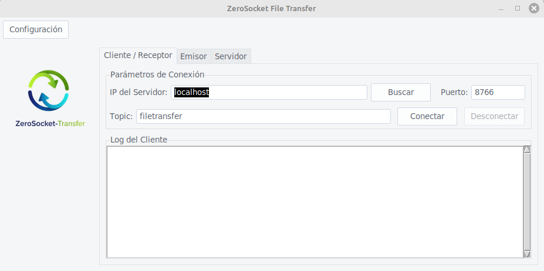

# ZeroSocket-Transfer

Aplicación de escritorio en Python para enviar y recibir archivos en una red local (LAN) usando el protocolo WebSocket, con autodescubrimiento de servidores mediante Zeroconf.



## Características Principales

*   **Interfaz Gráfica Sencilla**: Creada con Tkinter y ttkthemes para una experiencia de usuario limpia.
*   **Comunicación Eficiente con WebSockets**: Utiliza una conexión WebSocket persistente y bidireccional para una transferencia de archivos rápida y en tiempo real, ideal para entornos de red local.
*   **Arquitectura Cliente-Servidor**: Inicia un servidor en una máquina y conecta múltiples clientes.
*   **Distribución por Temas (Topics)**: Envía archivos solo a los clientes suscritos a un "topic" específico, permitiendo crear canales de distribución.
*   **Autodescubrimiento de Servidores**: No necesitas saber la IP. Usa el botón "Buscar" y la aplicación encontrará los servidores disponibles en la red gracias a Zeroconf (mDNS).
*   **Multiplataforma**: Al estar escrito en Python y Tkinter, debería funcionar en Windows, macOS y Linux.

## Instalación

Para poner en marcha el proyecto en tu máquina local, sigue estos pasos:

1.  **Clona el repositorio:**
    ```bash
    git clone https://github.com/soyunomas/ZeroSocket-Transfer.git
    cd ZeroSocket-Transfer
    ```

2.  **Crea y activa un entorno virtual:**
    *   En macOS / Linux:
        ```bash
        python3 -m venv .venv
        source .venv/bin/activate
        ```
    *   En Windows:
        ```bash
        python -m venv .venv
        .\.venv\Scripts\activate
        ```

3.  **Instala las dependencias:**
    ```bash
    pip install -r requirements.txt
    ```

## Uso

1.  **Ejecuta la aplicación:**
    ```bash
    python main_gui.py
    ```

2.  **Inicia el Servidor:**
    *   En una de las máquinas, ve a la pestaña "Servidor".
    *   Asegúrate de que el puerto y el topic son los que deseas.
    *   Haz clic en "Iniciar Servidor". El servicio se anunciará automáticamente en la red.

3.  **Conecta un Cliente (Receptor):**
    *   En otra máquina (o en la misma, para probar), abre la aplicación y ve a la pestaña "Cliente / Receptor".
    *   Haz clic en el botón "Buscar". Aparecerá una ventana con los servidores encontrados.
    *   Selecciona el servidor deseado. La IP y el Puerto se rellenarán solos.
    *   Asegúrate de que el "Topic" coincide con el que quieres recibir archivos.
    *   Haz clic en "Conectar".

4.  **Envía un Archivo:**
    *   Ve a la pestaña "Emisor".
    *   Los datos del servidor deberían coincidir con el servidor al que te quieres conectar.
    *   Selecciona un archivo y haz clic en "Enviar Archivo".

## Tecnologías Utilizadas

*   **Python 3**: Lenguaje principal.
*   **Tkinter**: Para la interfaz gráfica de usuario.
*   **websockets**: Para la comunicación en tiempo real entre cliente y servidor.
*   **zeroconf**: Para el descubrimiento de servicios en la red local (mDNS).

## Licencia

Este proyecto está bajo la Licencia MIT. Consulta el archivo `LICENSE` para más detalles.
